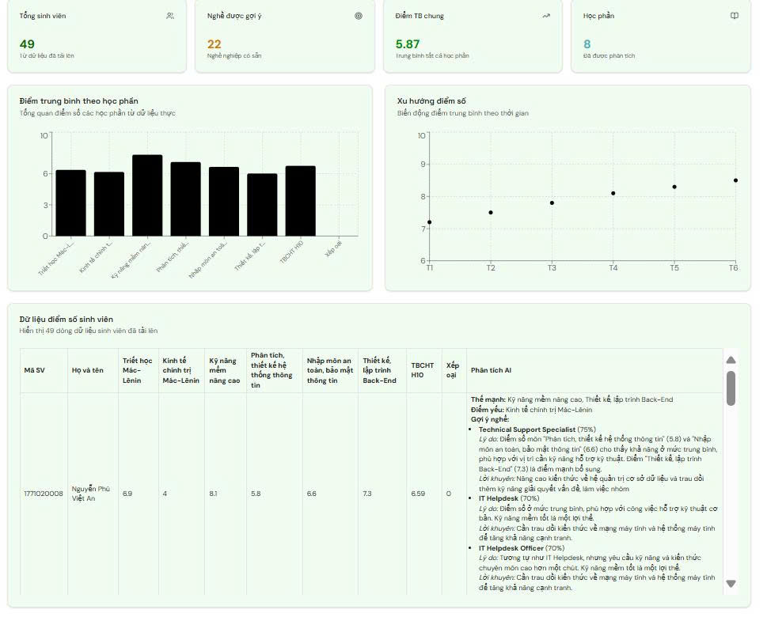
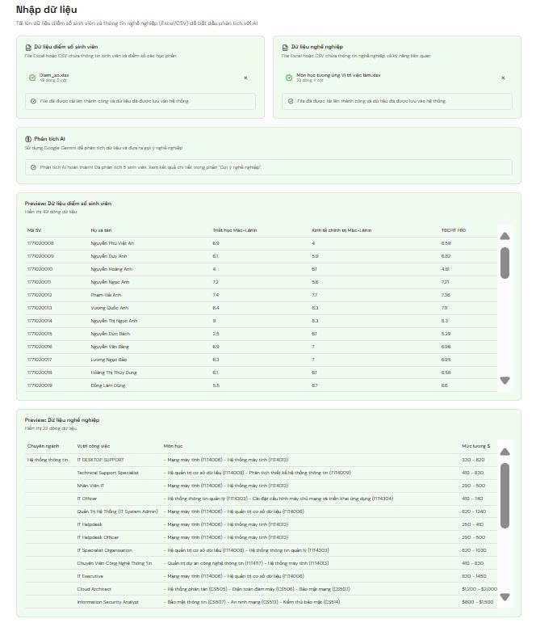
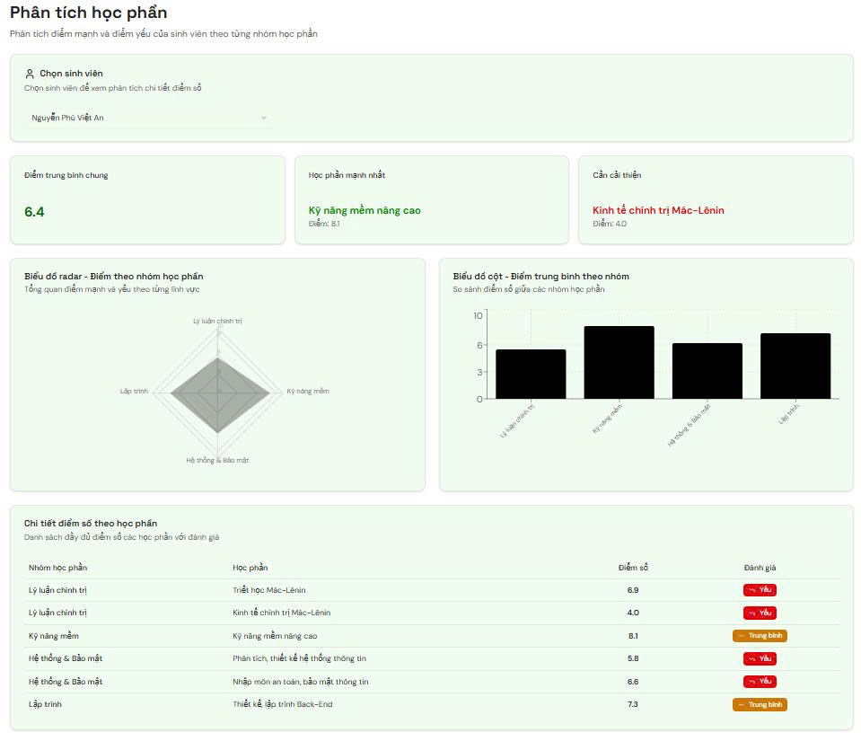
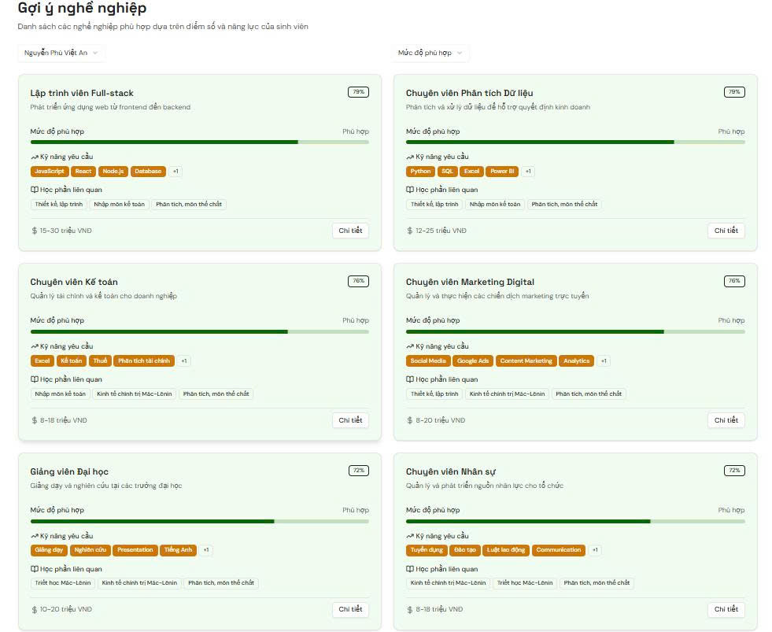
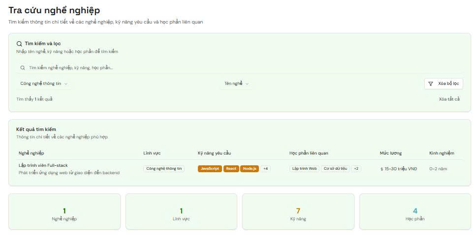

# 🎓 Hệ thống định hướng nghề nghiệp cho sinh viên

## 📖 Giới thiệu
**Hệ thống định hướng nghề nghiệp cho sinh viên** là một hệ thống hỗ trợ định hướng nghề nghiệp dựa trên phân tích dữ liệu học tập của sinh viên.  
Hệ thống kết hợp **kết quả học phần**, **kỹ năng chuyên môn** và **cơ sở dữ liệu nghề nghiệp** để đưa ra gợi ý phù hợp, giúp sinh viên lựa chọn nghề nghiệp đúng đắn.

---

## ⚙️ Kiến trúc hệ thống

```mermaid
flowchart TD
    A[📂 Nhập dữ liệu] --> B[(🗄️ CSDL)]
    B --> C[📊 Phân tích học phần]
    C --> D[💡 Gợi ý nghề nghiệp]
    D --> E[🔎 Tra cứu nghề nghiệp]
    B --> F[🏠 Trang chủ - Thống kê & Báo cáo]
````

---

## 📌 Chức năng chính

### 🏠 Trang chủ

* Hiển thị **thống kê tổng quan**: số lượng sinh viên, số nghề nghiệp được gợi ý, điểm trung bình chung, số học phần được phân tích.
* Biểu đồ trực quan:

  * **Biểu đồ cột**: điểm trung bình theo từng học phần.
  * **Biểu đồ đường**: xu hướng điểm số theo thời gian.
* Bảng dữ liệu chi tiết:

  * Thông tin từng sinh viên.
  * Điểm số, phân tích AI (điểm mạnh, điểm yếu).
  * Nghề nghiệp phù hợp được đề xuất.

📸 Ảnh minh họa:


---

### 📂 Nhập dữ liệu

* Cho phép tải lên:

  * **Dữ liệu điểm số sinh viên** (CSV).
  * **Dữ liệu nghề nghiệp**.
* Tự động phân tích và cập nhật vào cơ sở dữ liệu.
* Có **bảng xem trước (preview)** để kiểm tra dữ liệu trước khi nhập.

📸 Ảnh minh họa:


---

### 📊 Phân tích học phần

* Chọn từng sinh viên để xem phân tích chi tiết:

  * **Biểu đồ radar**: so sánh điểm số giữa các nhóm kỹ năng.
  * **Biểu đồ cột**: so sánh trung bình điểm số giữa các học phần.
* Bảng chi tiết: điểm số từng môn, kèm đánh giá xếp loại (Tốt, Trung bình, Yếu).

📸 Ảnh minh họa:


---

### 💡 Gợi ý nghề nghiệp

* Đưa ra danh sách nghề phù hợp dựa trên:

  * **Điểm số**.
  * **Nhóm kỹ năng học phần**.
* Thông tin nghề nghiệp bao gồm:

  * Mức độ phù hợp (%).
  * Kỹ năng yêu cầu.
  * Học phần liên quan.
  * Mức lương tham khảo.
* Ví dụ gợi ý:

  * Lập trình viên Full-stack.
  * Chuyên viên Phân tích dữ liệu.
  * Chuyên viên Marketing Digital.

📸 Ảnh minh họa:


---

### 🔎 Tra cứu nghề nghiệp

* Tìm kiếm nghề theo **từ khóa**.
* Lọc theo:

  * Lĩnh vực.
  * Kỹ năng yêu cầu.
  * Học phần liên quan.
* Hiển thị chi tiết nghề nghiệp:

  * Tên nghề, kỹ năng cần thiết.
  * Mức lương tham khảo.
  * Kinh nghiệm yêu cầu.
  * Học phần liên quan.
* Kết quả hiển thị dạng **bảng hoặc danh sách**, có thể sắp xếp theo lương, kỹ năng hoặc độ phổ biến.

📸 Ảnh minh họa:


---

## 🖥️ Công nghệ sử dụng

* **ASP.NET MVC** – xây dựng web application.
* **Entity Framework Core** – quản lý dữ liệu & truy vấn SQL Server.
* **SQL Server** – cơ sở dữ liệu quan hệ.
* **Chart.js** – trực quan hóa dữ liệu (biểu đồ).
* **Bootstrap 5** – giao diện responsive.

---

## 🚀 Cách chạy dự án

1. **Clone repository**

   ```bash
   git clone https://github.com/nguyenthiquynhhuongggg/Dinh_huong_nghe_nghiep.git
   cd Dinh_huong_nghe_nghiep
   ```

2. **Cấu hình database**

   * Mở file `appsettings.json`.
   * Chỉnh sửa `ConnectionStrings` trỏ đến SQL Server local của bạn.

   Ví dụ:

   ```json
   "ConnectionStrings": {
       "DefaultConnection": "Server=localhost;Database=CareerCompass;Trusted_Connection=True;MultipleActiveResultSets=true"
   }
   ```

3. **Chạy migration để tạo database**

   ```bash
   dotnet ef database update
   ```

4. **Chạy ứng dụng**

   ```bash
   dotnet run
   ```

5. Mở trình duyệt tại:
   👉 `http://localhost:5000` hoặc `https://localhost:5001`

---

## 👩‍💻 Nhóm phát triển

* **Nguyễn Thị Quỳnh Hương** – Backend
* **Lưu Thị Thu Hằng** – Data 
* **Nguyễn Văn Bằng** – Frontend
